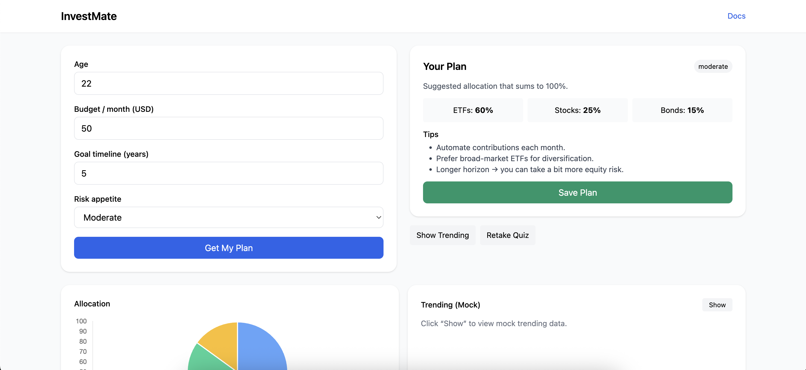
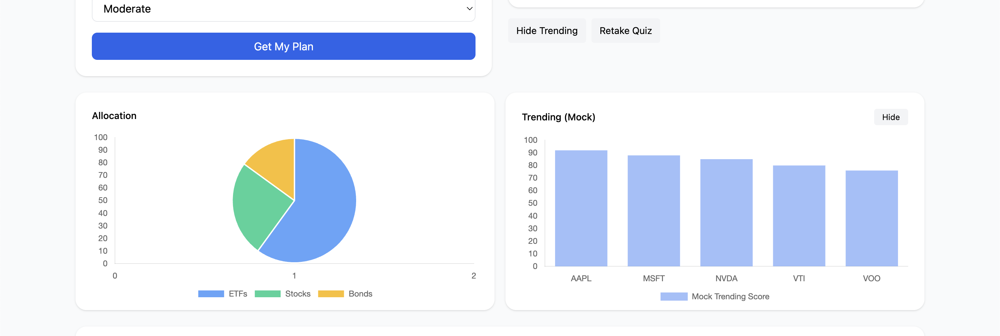
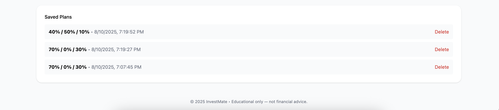
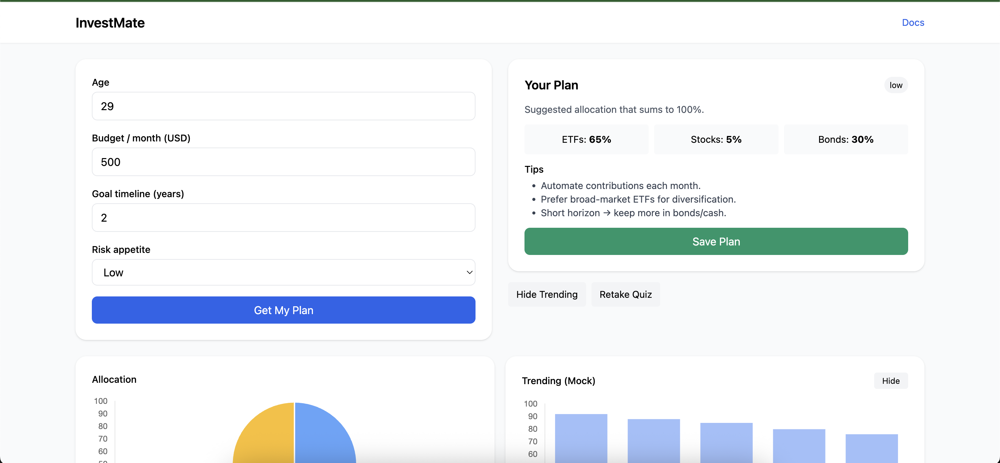

# InvestMate — Smarter Investing Guidance for Beginners

InvestMate is a beginner-friendly investment planning tool that removes the confusion of starting out.
By answering a few simple questions, users receive a tailored portfolio allocation with clear visual charts — all without creating an account.

This MVP focuses on speed, privacy, and clarity, making investing approachable for everyone.

---

## Demo
- Video walkthrough: https://drive.google.com/file/d/1UkXYIrWO0kUGq2X98bcb1wBcw50JBb4U/view

---

## Tech Stack used
- Frontend: React + Vite, Tailwind CSS, Chart.js (react-chartjs-2)
- Backend: Node.js + Express, MongoDB Atlas, Mongoose
- State management: React Hooks (useState, useEffect)
- Architecture: Container/Presenter pattern (QuizContainer vs QuizForm)

---

## Project Structure
```
investmate-mvp/
  client/                # React + Tailwind + Chart.js
  server/                # Express + MongoDB + Mongoose
  README.md
  .gitignore
  demo-script.md
```

---

## Installation & Running Locally

### 1) Backend
```bash
cd server
cp .env.example .env     # Add your MongoDB connection string
npm install
npm run dev              # Runs on http://localhost:4000
```

### 2) Frontend
```bash
cd ../client
npm install
npm run dev              # Runs on http://localhost:5173
```

The client assumes API URL http://localhost:4000 by default. You can override via `VITE_API_URL` in `client/.env` if needed.

---

## Features Implemented
- No-signup quiz → personalized allocation plan (pie chart)
- Mock “Trending” bar chart (toggle)
- Save plans anonymously via anonId (localStorage) to MongoDB
- View/delete saved plans
- Basic validation and responsive Tailwind UI
- Educational disclaimer

---

## API (Brief)
- POST `/api/quiz/plan`  
  Body:
  ```json
  { "age": 30, "budget": 5000, "goalYears": 10, "risk": "moderate" }
  ```
  Response:
  ```json
  {
    "allocation": { "etf": 40, "stocks": 40, "bonds": 20 },
    "riskLevel": "Moderate",
    "tips": ["Diversify", "Review yearly"]
  }
  ```

- POST `/api/plans`  
  Body: `{ "anonId": "12345", "allocation": { ... }, "riskLevel": "Moderate" }`

- GET `/api/plans?anonId=12345`

- DELETE `/api/plans/:id`

---

## Screenshots





---

## Known Issues
- Trending uses mock data (no live market feed).
- Allocation logic is simplified for an educational MVP.
- Minimal automated tests in this version.

---

## Commit History
commit history: https://github.com/Subhanshrestha/investmate-mvp/commits/main

---

## Roadmap
- Real market data for trending
- Richer investor profiling and goal-based advice
- Export plan as PDF and shareable link
- Optional authentication for multi-device sync
- Unit and end-to-end tests

---

## Contact
Subhan Shrestha  
Email: shresthasubhan@gmail.com  
LinkedIn: https://linkedin.com/in/subhanshrestha
